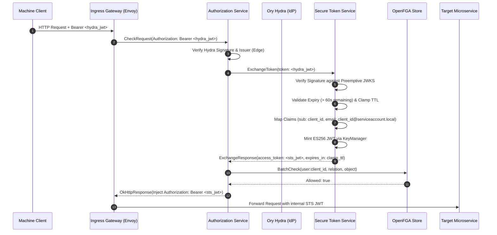

# Design: Machine-to-Machine (M2M) Token Exchange via gRPC

## Context
For motivation and business drivers, see [proposal.md](proposal.md).
Currently, the Secure Token Service (STS) server hosts:
1. An HTTP server handling OIDC and Ubuntu One OpenID login redirects and session lifecycle.
2. A gRPC server exposing `ExchangeSession` and `RevokeUserSessions`.
3. A `KeyManager` that generates, saves, and rotates ES256 keypairs in PostgreSQL (`hydra_jwk` table) and exposes JWKS.

To support M2M callers using the OAuth2 Client Credentials grant via Ory Hydra, STS must introduce the `ExchangeToken` gRPC RPC. Downstream services (such as `authorization-service` acting as Envoy external authorization) will verify the Hydra token at ingress and invoke `ExchangeToken` to receive an internal STS JWT signed with the active ES256 key.

## Goals / Non-Goals

### Goals
- Expose `ExchangeToken` over gRPC matching `api/proto/v1/sts.proto`.
- Perform defense-in-depth cryptographic verification of Hydra access tokens using a preemptively synchronized JWKS cache.
- Enforce strict expiration boundaries: reject tokens with `< 60s` remaining validity and clamp minted internal token TTL to `min(configured_expiry, remaining_upstream_validity)`.
- Produce standard STS JWTs containing `sub: <client_id>` and synthetic email `<client_id>@serviceaccount.local` for downstream service compatibility.
- Seamlessly support OpenFGA actor mapping in downstream authorization services as `user:<client_id>`.

### Non-Goals
- Immediate token caching in Valkey (the initial release is stateless; caching is planned as a mid-term enhancement).
- Scope enforcement or role-based access control inside STS (all authorization policy enforcement is evaluated by `authorization-service` via OpenFGA).
- Propagating raw OAuth2 scopes or principal typing into the token payload during phase 1 (documented as a future extension).

## System Architecture Model (Archify - Dark Theme)

The machine client credentials architecture has been modeled, validated, and rendered via **Archify**:
- **Interactive Visual Artifact**: [`secure-token-service.html`](file:///home/shipperizer/shipperizer/secure-token-service/.archify/architecture-secure-token-service-20261008-154500/secure-token-service.html)
- **Candidate Specification**: [`candidate.json`](file:///home/shipperizer/shipperizer/secure-token-service/.archify/architecture-secure-token-service-20261008-154500/candidate.json)
- **Visual Verification Capture (Dark Theme)**: [`secure-token-service.visual-check.1440x900.dark.png`](file:///home/shipperizer/shipperizer/secure-token-service/.archify/architecture-secure-token-service-20261008-154500/visual-check/secure-token-service.visual-check.1440x900.dark.png)

## Architecture & Sequence

## Decisions

### Decision 1: Defense-in-Depth Cryptographic Signature Verification
- **Decision**: STS will independently verify the cryptographic signature and issuer of the incoming Hydra token against Hydra's JWKS endpoint, rather than relying solely on edge verification by the authorization service.
- **Rationale**: Establishes a strict zero-trust boundary within the internal mesh. Even if an unauthenticated internal service or misconfigured gateway reaches STS's gRPC endpoint, STS will not mint valid internal tokens for unsigned or fabricated payloads.
- **Alternatives Considered**:
  - *Edge-only verification (STS merely unmarshals payload)*: Lower CPU overhead, but violates zero-trust principles and exposes STS to privilege escalation if internal gRPC caller identity is ever compromised.

### Decision 2: Preemptive JWKS Cache Synchronization
- **Decision**: Implement a background auto-refreshing JWKS cache (using `lestrrat-go/jwx/v2/jwk.Cache` or a background ticker) that actively polls Hydra's `.well-known/jwks.json` on a fixed interval (e.g., every 5–10 minutes) with preemptive warm-up during STS server startup.
- **Rationale**: Eliminates latency spikes on incoming client requests. Standard on-demand fetching or reactive refetching on cache miss causes unpredictable p99 latency regressions and makes STS vulnerable to Hydra JWKS availability blips during user requests.
- **Alternatives Considered**:
  - *Lazy on-demand fetch on miss*: Causes request latency spikes of 50–200ms when keys rotate or after cache eviction.
  - *Static key configuration*: Requires manual redeployment or configuration updates during IdP key rotation, causing potential outages.

### Decision 3: Synthetic Email for Machine Identities
- **Decision**: Set `sub: <client_id>` and synthesize `email: <client_id>@serviceaccount.local`.
- **Rationale**: Downstream microservices across the ecosystem currently assume the existence of an `email` claim in internal STS JWTs (from human OIDC/Ubuntu One sessions). Using a synthetic domain (`@serviceaccount.local`) guarantees backward compatibility across all legacy consumers without breaking JWT parsing or schema assertions.
- **Alternatives Considered**:
  - *Omitting the email claim*: Would require auditing and modifying every downstream internal microservice to make `email` optional.
  - *Setting email equal to client_id*: Could cause downstream parsing bugs if services attempt to parse email domains or validate email formats.

### Decision 4: Expiration Threshold and Clamping Policy
- **Decision**: 
  1. If `upstream_token.exp - now < 60s`, reject the request with `codes.Unauthenticated`.
  2. If `upstream_token.exp - now >= 60s`, issue the internal token with TTL `min(configured_expiry, upstream_token.exp - now)`.
- **Rationale**:
  - Prevents privilege extension: Downstream services will never accept an internal token that lives longer than the machine's authorized upstream credential.
  - Mitigates race conditions: If a machine presents a token with only 5 seconds of validity remaining, network delays between Envoy, `authorization-service`, STS, and the upstream microservice would cause the request to fail in transit. The 60-second threshold enforces proactive client credential token renewal by the calling machine.

### Decision 5: Initial Stateless Execution with Mid-Term Caching Path
- **Decision**: Launch Phase 1 statelessly (minting an ES256 token on each exchange request). Design the interface so that Valkey caching (`sha256(token) -> sts_jwt` with TTL) can be enabled seamlessly in Phase 2.
- **Rationale**: Eliminates state synchronization, cache invalidation bugs, and complexity during the initial rollout. The existing `KeyManager` handles ECDSA P-256 signing efficiently.
- **Alternatives Considered**:
  - *Immediate Valkey caching*: Increases surface area and testing requirements before the baseline gRPC contract is verified in production.

## Future Enhancements (TODOs)

1. **TODO: Valkey Token Exchange Caching**:
   - Cache minted internal JWTs in Valkey keyed by SHA-256 hash of the incoming Hydra token: `m2m:cache:<sha256(token)> -> <sts_jwt>`.
   - Set cache TTL to `min(clamped_ttl, 300s)`.
   - Bypasses ES256 signing for high-frequency polling daemons.

2. **TODO: OAuth2 Scope & Principal Type Propagation**:
   - Evaluate whether microservices require granular OAuth2 scopes in the internal JWT (`scopes: ["read:reports"]`).
   - Introduce an explicit `principal_type: "machine"` claim once downstream services are updated to consume it.

## Risks & Trade-offs

| Risk | Impact | Mitigation |
| :--- | :--- | :--- |
| **Hydra JWKS endpoint unreachable at startup** | STS startup failure or delayed readiness | Preemptive fetcher logs a warning and retries with exponential backoff; health checks reflect JWKS synchronization status. |
| **High request volume causes CPU spikes from ES256 signing** | Elevated gRPC latency at peak load | Benchmark ES256 signing throughput (expected ~2,000–5,000 ops/sec per core); deploy horizontal pod autoscaling and prioritize the Valkey caching TODO if CPU limits are approached. |
| **Clock skew between Hydra and STS** | Premature rejection or erroneous clamping | Configure a small clock skew tolerance (e.g., 5 seconds) when evaluating `iat` and `exp`. |
| **Upstream token lacks client_id or sub** | Identification failure | Fallback hierarchy: inspect `client_id`, fallback to `sub`. If neither is present, return `codes.InvalidArgument`. |

## Observability & Telemetry

- **Metrics**:
  - `grpc_server_handled_total{grpc_method="ExchangeToken",grpc_code="OK|InvalidArgument|Unauthenticated|Internal"}`.
  - `sts_m2m_token_exchange_duration_seconds` (histogram).
  - `sts_hydra_jwks_sync_total{status="success|failure"}`.
  - `sts_m2m_token_clamped_ttl_seconds` (histogram).
- **Logging**:
  - Zap structured log entries for every exchange with `client_id`, `token_id`, `clamped_ttl`, and trace ID (excluding raw token secrets).
- **Tracing**:
  - OpenTelemetry spans for `SecurityTokenService/ExchangeToken` propagated into internal minting and JWKS lookup spans.
