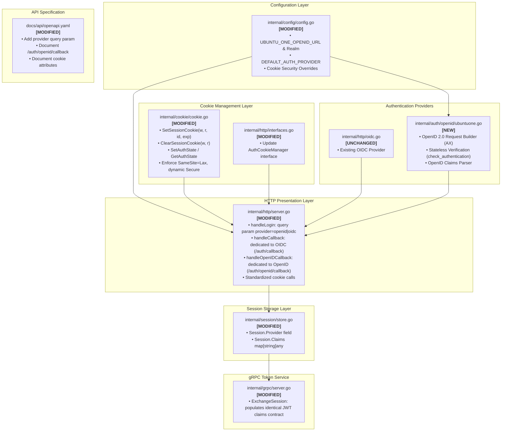

# Architecture Design: Ubuntu One OpenID & Standardized Cookie Generation

## Context

The Secure Token Service (STS / Janus) implements the Phantom Token Pattern, allowing external web clients to authenticate via upstream Identity Providers and receive opaque session cookies, while internal microservices exchange these cookies via gRPC for short-lived, cryptographically signed internal JWTs (ADR-004).

Currently, the service only integrates with an OpenID Connect (OIDC) provider. However, many systems across Canonical require authentication via **Ubuntu One Single Sign-On** (`login.ubuntu.com/+openid`), which implements the OpenID 2.0 protocol with Attribute Exchange (AX).

To support this without compromising future architectural health, this design adheres to three core principles established during discovery:
1. **Plain Binary Authentication**: No Launchpad team memberships or access gating; authentication is plain and simple (valid user vs rejected).
2. **External & Downstream Parity**: The external session cookie and internal JWT contracts (`sub: email`, `email: email`) are strictly identical regardless of whether a user logs in via OIDC or OpenID.
3. **Clean Sunsetting Path via Dedicated Callbacks**: The OpenID callback is isolated at `/auth/openid/callback`, keeping the primary OIDC callback (`/auth/callback`) pure. When Ubuntu One OpenID is eventually retired, the OpenID callback and provider code can be cleanly deleted without impacting OIDC.

---

## Goals / Non-Goals

### Goals
- **Multi-Provider Login Endpoint**: Allow clients to request either OIDC or Ubuntu One OpenID via `/auth/login?provider=openid` or `?provider=oidc` (defaulting to `oidc`).
- **Dedicated OpenID Callback (`/auth/openid/callback`)**: Dedicated route for handling Ubuntu One OpenID responses, separating legacy OpenID 2.0 handling from modern OIDC flow.
- **Ubuntu One OpenID 2.0 Relying Party**: Implement a lightweight OpenID 2.0 relying party client that requests basic user attributes (email, nickname, fullname) via Attribute Exchange (AX) and verifies assertions directly via `check_authentication`.
- **Standardized Cookie Management**: Refactor `CookieManager` into the single authority for creating, formatting, and clearing all cookies (`session_id`, `oauth_state`, `oauth_nonce`) with unified security attributes (`HttpOnly: true`, `SameSite: Lax`, dynamic `Secure` based on request protocol, standardized `Path: "/"`).
- **Downstream Parity**: Ensure that internal JWTs minted by gRPC `ExchangeSession` maintain complete parity (`sub: email`, `email: email`).

### Non-Goals
- Launchpad team querying or team-based authorization gating.
- Full OpenID 2.0 server implementation (STS is strictly a consumer / relying party).
- Stateful Diffie-Hellman association caching for OpenID 2.0. Stateless direct verification (`check_authentication`) is standard for containerized microservices.
- Multi-domain cookie scoping (`COOKIE_DOMAIN`); cookies remain host-only.

---

## Component Map: What Pieces Are We Touching?

The following map highlights the touched components and structural relationships:



### Detailed Component Touch Breakdown

| File / Component | Status | Responsibilities & Changes |
|---|---|---|
| [`internal/config/config.go`](file:///home/shipperizer/shipperizer/secure-token-service/internal/config/config.go) | Modified | Adds `UBUNTU_ONE_OPENID_URL` (default: `https://login.ubuntu.com/+openid`), `UBUNTU_ONE_REALM`, and `DEFAULT_AUTH_PROVIDER`. |
| [`internal/cookie/cookie.go`](file:///home/shipperizer/shipperizer/secure-token-service/internal/cookie/cookie.go) | Modified | Encapsulates full session cookie generation (`SetSessionCookie`, `ClearSessionCookie`), updates state cookie to store provider metadata (`SetAuthState`, `GetAuthState`), standardizes `SameSite=Lax`, dynamic `Secure`, and `HttpOnly`. |
| [`internal/http/interfaces.go`](file:///home/shipperizer/shipperizer/secure-token-service/internal/http/interfaces.go) | Modified | Expands `AuthCookieManager` to include session cookie setter/clearer and generic `AuthState` methods. Defines `OpenIDProvider` interface. |
| `internal/auth/openid/ubuntuone.go` | **New** | OpenID 2.0 relying party implementation: builds redirect URL with AX schemas (`email`, `nickname`, `fullname`), performs direct HTTP POST `check_authentication` verification, parses response. |
| [`internal/session/store.go`](file:///home/shipperizer/shipperizer/secure-token-service/internal/session/store.go) | Modified | Extends `Session` struct with `Provider string` and `Claims map[string]interface{}` to retain upstream claims in Valkey. |
| [`internal/http/server.go`](file:///home/shipperizer/shipperizer/secure-token-service/internal/http/server.go) | Modified | `handleLogin`: reads `?provider=...`, generates state preserving provider choice, redirects to selected IdP.<br/>`handleCallback`: handles existing OIDC flow.<br/>`handleOpenIDCallback`: **new handler** dedicated to OpenID callback, verifies response with Ubuntu One, normalizes claims, sets standardized session cookie. |
| [`internal/grpc/server.go`](file:///home/shipperizer/shipperizer/secure-token-service/internal/grpc/server.go) | Modified | `ExchangeSession`: ensures downstream JWT contract (`sub: email`, `email: email`) is maintained identically across both providers. |
| [`docs/api/openapi.yaml`](file:///home/shipperizer/shipperizer/secure-token-service/docs/api/openapi.yaml) | Modified | Documents the `provider` query parameter on `/auth/login`, `/auth/openid/callback`, and updated cookie flags. |

---

## End-to-End Architecture

```mermaid
sequenceDiagram
    autonumber
    actor User as User Agent / Browser
    participant STS as STS (Janus) HTTP Server
    participant CookieMgr as CookieManager
    participant Valkey as Valkey Session Store
    participant IdP_OIDC as Upstream OIDC IdP
    participant U1_OpenID as Ubuntu One OpenID 2.0
    participant Gateway as API Gateway (Envoy)
    participant STS_GRPC as STS gRPC Service

    Note over User,STS: Phase 1: Multi-Provider Login Initiation
    User->>STS: GET /auth/login?provider=openid&return_to=/dashboard
    STS->>CookieMgr: SetAuthState(w, r, AuthState{Provider: "openid", ReturnTo: "/dashboard"})
    CookieMgr-->>STS: Set encrypted oauth_state cookie
    STS-->>User: 302 Redirect to https://login.ubuntu.com/+openid?openid.return_to=/auth/openid/callback&...

    Note over User,U1_OpenID: Phase 2: Ubuntu One Authentication
    User->>U1_OpenID: Authenticates & grants attributes
    U1_OpenID-->>User: 302 Redirect to /auth/openid/callback?openid.mode=id_res&openid.sig=...&openid.ax...

    Note over User,STS: Phase 3: Dedicated OpenID Callback Verification
    User->>STS: GET /auth/openid/callback?openid.mode=id_res&... (with oauth_state cookie)
    STS->>CookieMgr: GetAuthState(r)
    CookieMgr-->>STS: AuthState{Provider: "openid", ReturnTo: "/dashboard"}
    
    STS->>U1_OpenID: POST /+openid (openid.mode=check_authentication)
    U1_OpenID-->>STS: is_valid:true
    STS->>STS: Extract attributes (email, nickname, fullname)
    STS->>STS: Resolve UserID = email (fallback: nickname -> claimed_id)

    Note over STS,Valkey: Phase 4: Session Creation & Standardized Cookie
    STS->>Valkey: Store Session (SessionID, UserID: email, Provider: "openid", Expiry)
    STS->>CookieMgr: SetSessionCookie(w, r, sessionID, expiresAt)
    CookieMgr-->>STS: Standardized Set-Cookie: session_id=...; HttpOnly; SameSite=Lax; Secure
    STS-->>User: 302 Redirect to /dashboard

    Note over User,STS_GRPC: Phase 5: Phantom Token Exchange (Complete Parity)
    User->>Gateway: GET /api/v1/resource (Cookie: session_id=...)
    Gateway->>STS_GRPC: ExchangeSession(session_cookie)
    STS_GRPC->>Valkey: Get(sessionID)
    Valkey-->>STS_GRPC: Session (UserID: email)
    STS_GRPC->>STS_GRPC: Mint ES256 JWT (sub: email, email: email)
    STS_GRPC-->>Gateway: Return AccessToken (Internal JWT)
```

---

## Standardized Cookie Architecture

All cookie mutations are centralized in `CookieManager`, ensuring defense-in-depth and dynamic environment adaptation:

```
    Request (r *http.Request)
        │
        ├── Detect TLS: r.TLS != nil || r.Header.Get("X-Forwarded-Proto") == "https"
        │
        ▼
   CookieManager.buildCookie(name, value, expires, maxAge)
        │
        ├── Name:       "session_id" | "oauth_state" | "oauth_nonce"
        ├── Value:      Encrypted via chmike/securecookie AEAD (ChaCha20-Poly1305)
        ├── Path:       "/"
        ├── HttpOnly:   true (Prevents XSS theft)
        ├── SameSite:   http.SameSiteLaxMode (CSRF defense)
        ├── Secure:     dynamic (true if TLS / https proxy, false if plain local HTTP)
        └── Expires:    sess.ExpiresAt (or time.Unix(0, 0) on clear)
        │
        ▼
   http.SetCookie(w, cookie)
```

### Public API Additions to CookieManager:
- `SetSessionCookie(w http.ResponseWriter, r *http.Request, sessionID string, expiresAt time.Time) error`
- `ClearSessionCookie(w http.ResponseWriter, r *http.Request)`
- `SetAuthState(w http.ResponseWriter, r *http.Request, state AuthState) (string, error)`
- `GetAuthState(r *http.Request) (*AuthState, error)`
- `ClearAuthState(w http.ResponseWriter, r *http.Request)`

---

## Claims Normalization and Parity Strategy

To avoid disrupting downstream services, internal tokens maintain strict structural parity.

### Claims Mapping

| Internal Claim | Ubuntu One Attribute | OIDC Claim | Resolution Rule |
|---|---|---|---|
| **`sub`** | `openid.ax.value.email` | `sub` / `email` | Set to user email address (Option A) |
| **`email`** | `openid.ax.value.email` | `email` | Set to user email address |
| **`nickname`** | `openid.ax.value.nickname` | `preferred_username` | Optional supplemental claim if present |
| **`name`** | `openid.ax.value.fullname` | `name` | Optional supplemental claim if present |

If email is missing in the OpenID response, the normalizer falls back to `nickname` or the unique `claimed_id` as the identity, but in normal Ubuntu One usage `email` is universally requested and populated.

---

## Technical Decisions & Trade-Offs

### 1. Dedicated Callback Endpoint (`/auth/openid/callback`) vs. Multiplexed Callback
- **Decision**: Introduce a dedicated `/auth/openid/callback` endpoint for Ubuntu One OpenID, leaving `/auth/callback` strictly for OIDC.
- **Rationale**: When OpenID is eventually sunset, removing this support is as simple as deleting the `/auth/openid/callback` handler and its associated package. The OIDC callback logic remains untouched, avoiding regression risks or tangled conditional code.
- **Trade-off**: Requires configuring Ubuntu One with the specific callback route (`/auth/openid/callback`), which is a one-time configuration step.

### 2. Stateless (`check_authentication`) Verification vs. Stateful Associations
- **Decision**: Use stateless direct verification by issuing an HTTP POST to `login.ubuntu.com/+openid` with `openid.mode=check_authentication`.
- **Rationale**: Avoids maintaining stateful Diffie-Hellman association keys and cache synchronization across STS instances. Stateless verification is resilient, simple, and self-contained.
- **Trade-off**: Incurs one outbound HTTP call during callback verification (~100ms), which is entirely acceptable for a login flow.

### 3. Downstream Token Parity (Option A)
- **Decision**: Downstream internal JWTs use `sub: email` and `email: email` regardless of provider.
- **Rationale**: Downstream microservices do not need to know or care which provider authenticated the user. The contract remains 100% stable.

---

## Risks / Trade-Offs

| Risk | Mitigation |
|---|---|
| **OpenID Replay Attacks** | Ubuntu One includes `openid.response_nonce`. The OpenID verifier validates that the nonce timestamp is within acceptable skew (5 minutes) and uses the state cookie correlation. |
| **Missing Email in OpenID Response** | While AX requests `email` as required, the claims normalizer gracefully falls back to `nickname` or `claimed_id` rather than panicking. |
| **Local Development without HTTPS** | Dynamic `Secure` cookie flag evaluation detects TLS or `X-Forwarded-Proto: https`. On plain HTTP `localhost:8080`, cookies remain usable without requiring self-signed certs. |
| **State Cookie Tampering** | Handled transparently by `chmike/securecookie` using ChaCha20-Poly1305 authenticated encryption with key length validation (ADR-001). |

---

## Observability & Security Considerations

- **Metrics**: Add Prometheus counter `sts_logins_total{provider="oidc|openid", status="success|failure"}`.
- **Tracing**: Create OpenTelemetry span `openid.verify` to measure Ubuntu One `check_authentication` latency.
- **Logging**: Log provider choice and user identifier without logging raw cookie secrets or signature values.
- **Redirect Security**: Strict validation on `return_to` via `isValidReturnTo()` against allowed hosts.
